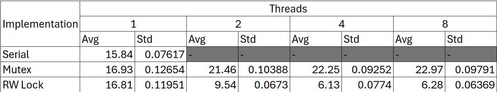
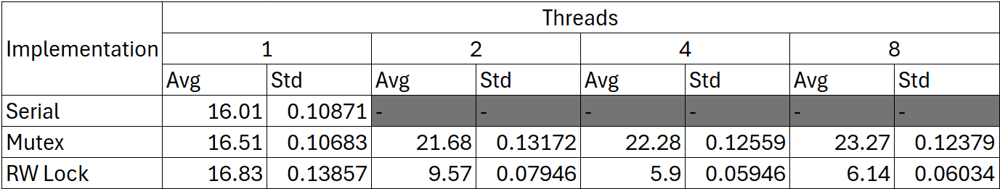
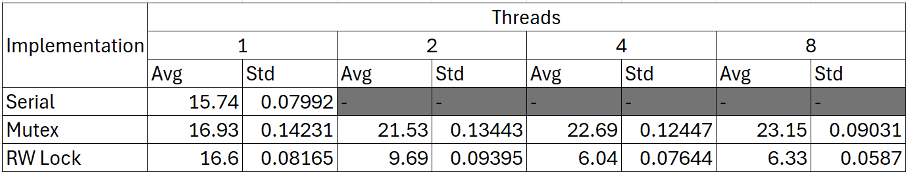
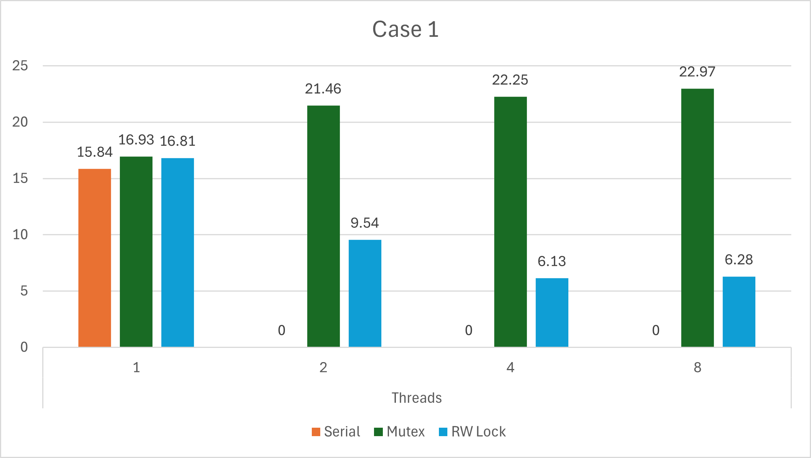
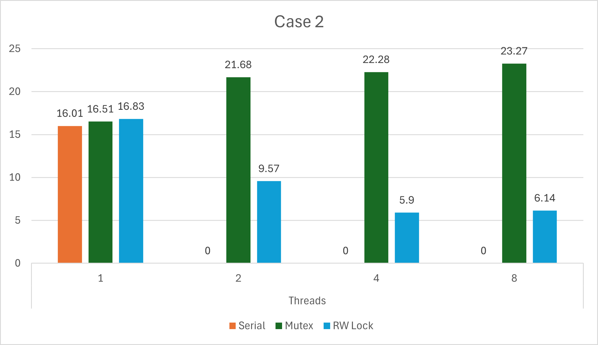
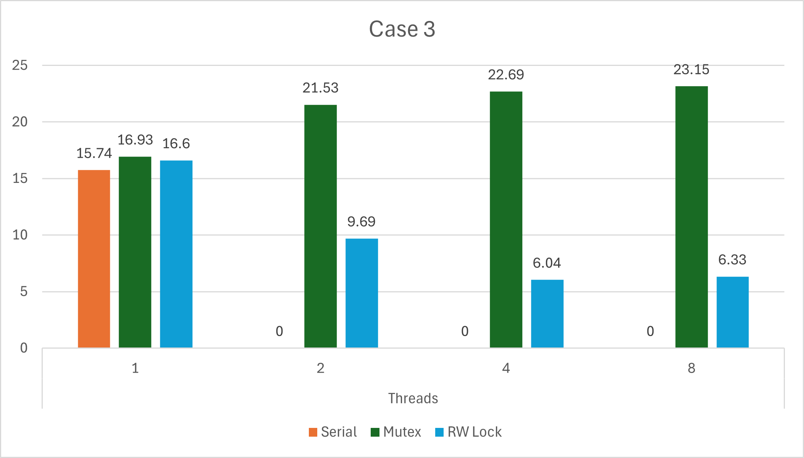
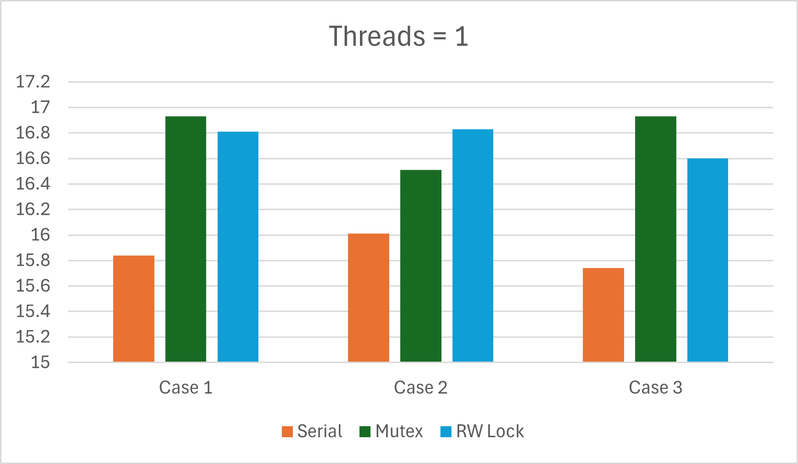

# Lab1 - Report
## Authors
- Chathura Gunasekara (200193U)
- Thanushanth Sivakumar (200192V)

# Project structure
The project structure is as follows:
```
.
├── README.md
├── src
│   ├── linked_list_mutex.c
│   ├── linked_list_mutex.h
│   ├── linked_list_rwlock.c
│   ├── linked_list_rwlock.h
│   ├── linked_list_serial.c
│   ├── linked_list_serial.h
├── test
│   ├── test_mutex.c
│   ├── test_rwlock.c
│   ├── test_serial.c
├── logs
│   ├── mutex.log
│   ├── rwlock.log
│   ├── serial.log
├── scripts
│   ├── test.sh
├── logs
├── bin
├── docs
```

The `src` directory contains the source code for the linked list implementations. The `test` directory contains the test code for the linked list implementations. The `logs` directory contains the log files generated by the test code. The `bin` directory contains the compiled binaries. The `docs` directory contains the documentation for the project. The `scripts` directory contains the test script to run the tests.

# Running the project
To run the tests, use the makefile in the test directory. This can be done by navigating to the test directory and running the following commands:
```bash
cd test
make all
cd ..
```

Next navigatye to the scripts directory and run the test script:
```bash
cd scripts
source test.sh  
cd ..
```
This script code will run the test code for the simple serial linked list, the concurrent linked list with mutexes, and the concurrent linked list with read-write locks with different number of threads. The tests are run for multiple times and the log files are generated in the logs directory. 

This will run the executables in the bin directory and generate log files in the logs directory.

# Implementation

## Task 1 - Implementing of three versions of the linked list

### Task 1.1 - Simple serial linked list
This is a simple linked list implementation designed for serial execution. The linked list is implemented using a struct named `Node` which contains a value and a pointer to the next node. The implementation can be found in the `linked_list_serial.c` and `linked_list_serial.h` files in the `src` directory.

### Task 1.2 - Concurrent linked list with mutexes
This is a concurrent linked list implementation designed for concurrent execution using mutexes. The linked list is implemented using a struct named `Node` which contains a value and a pointer to the next node. The implementation can be found in the `linked_list_mutex.c` and `linked_list_mutex.h` files in the `src` directory.

### Task 1.3 - Concurrent linked list with read-write locks
This is a concurrent linked list implementation designed for concurrent execution using read-write locks. The linked list is implemented using a struct named `Node` which contains a value and a pointer to the next node. The implementation can be found in the `linked_list_rwlock.c` and `linked_list_rwlock.h` files in the `src` directory.

## Task 2 - Testing the linked list implementations

### Task 2.1 - Testing the simple serial linked list
The test code for the simple serial linked list implementation can be found in the `test_serial.c` file in the `test` directory. The test code creates a linked list, inserts elements into the list, and deletes elements from the list. Finally, the test code prints the time taken to perform the operations.

### Task 2.2 - Testing the concurrent linked list with mutexes
The test code for the concurrent linked list with mutexes implementation can be found in the `test_mutex.c` file in the `test` directory. The test code creates a linked list, inserts elements into the list, and deletes elements from the list concurrently using multiple threads. Finally, the test code prints the time taken to perform the operations.

### Task 2.3 - Testing the concurrent linked list with read-write locks
The test code for the concurrent linked list with read-write locks implementation can be found in the `test_rwlock.c` file in the `test` directory. The test code creates a linked list, inserts elements into the list, and deletes elements from the list concurrently using multiple threads. Finally, the test code prints the time taken to perform the operations.

## Task 3 - Running the tests
The test script in the `scripts` directory runs the test code for the simple serial linked list, the concurrent linked list with mutexes, and the concurrent linked list with read-write locks with different number of threads. The tests are run for multiple times and the log files are generated in the `logs` directory. The mean and standard deviation of the time taken to perform the operations are calculated using the `analyse.py` script in the `scripts` directory and the results are written to the `results.csv` file in the `logs` directory.

# Results
## Tabulated results
### Case 1


### Case 2


### Case 3


## Graphical results
### Case 1


### Case 2


### Case 3


# Conclusion
Considering the number of threads used in all 3 cases, it is observed that the serial implementation performs best while the mutex implementation performs worst. The rwlock implementation performs better than the mutex implementation but worse than the serial implementation. The rwlock implementation performs better than the mutex implementation because it allows multiple readers to access the list concurrently. The serial implementation performs best because it does not have any overhead associated with concurrency control. The rwlock implementation performs worse than the serial implementation because of the overhead associated with read-write locks. The mutex implementation performs worst because it does not allow multiple threads to access the list concurrently.



Comparing the multithreaded cases, rwlock implementation shows a clear advantage over the mutex implementation. This is because the rwlock implementation allows multiple readers to access the list concurrently, while the mutex implementation does not. The rwlock implementation performs better than the mutex implementation because it allows multiple threads to read the list concurrently, while the mutex implementation only allows one thread to access the list at a time. Also it is observed that the mutex approach is not scalable as the number of threads increases. This is because the mutex implementation does not allow multiple threads to access the list concurrently, which leads to contention and performance degradation (even when compared with the serial implementation).